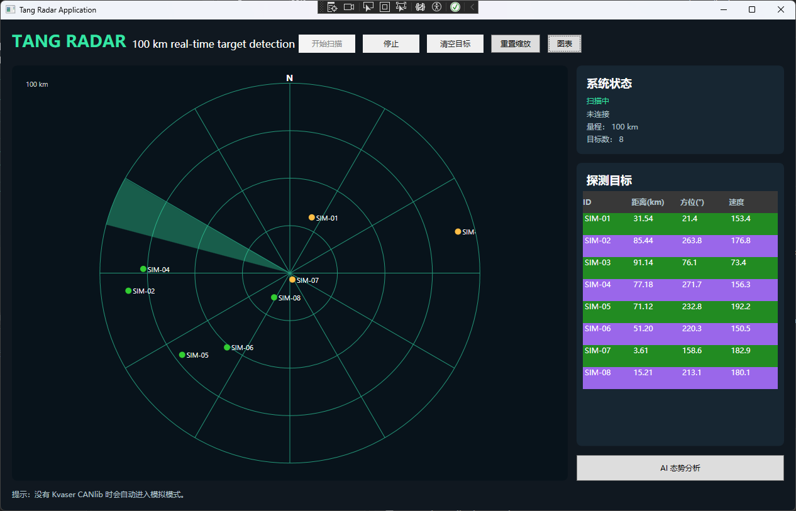

# Tang.RadarApplication

.NET Framework 4.8 WPF radar demonstration added to `ayu-6666/WPF-Demo`.

## Features

- WPF + MVVM with `CommunityToolkit.Mvvm`.
- `WPFDevelopers` 0.2.0 package reference.
- 0–100 km radar scope, animated sweep, target list and simulated targets.
- Kvaser CAN integration boundary with a documented frame mapping; the vendor CANlib SDK is not redistributed.
- Optional OpenAI Platform analysis through `OPENAI_API_KEY` (never store the key in the client or repository).

## Build and run

Open `Tang.RadarApplication/Tang.RadarApplication.csproj` in Visual Studio 2022 with .NET Framework 4.8 Developer Pack, restore NuGet packages, then run. Without Kvaser CANlib the app starts the simulator automatically.

Set `OPENAI_API_KEY` only if AI analysis is required. The sample CAN mapping is documented in `Services/KvaserCanDataSource.cs`; adapt `StartAsync` to the exact Kvaser CANlib version, channel and radar protocol before connecting hardware.

This is a visualization/demo application, not a certified radar safety or target-identification system.
